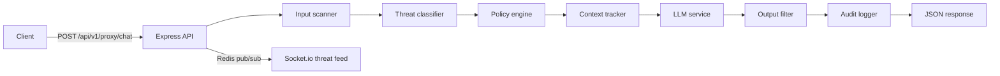

# Kavach.LLM — Intercept. Analyse. Shield.

Kavach.LLM is an intelligent LLM security middleware platform that sits between clients and an LLM provider. It scans prompts and outputs, classifies threats, applies user-defined policies, tracks session context, publishes live threat events, and writes structured audit logs.

## Hackathon / problem-statement mapping

| Theme | How Kavach.LLM addresses it |
|--------|-----------------------------|
| **Trust & safety for GenAI** | Input scanner, multi-category threat classifier, output filter, arbitration, and policy actions (allow, block, warn, redact, rate-limit, quarantine). |
| **Enterprise readiness** | JWT auth, API keys with reputation scoring, compliance presets and PDF report, audit trail with export, rate limiting with Redis. |
| **Observability** | Dashboard analytics, live WebSocket threat feed, per-request latencies in proxy responses, persona drift signals. |
| **Developer experience** | Monorepo with shared tooling, `/proxy/chat` pipeline, Google Gemini-backed LLM service, playground UI for scan vs full pipeline, Docker Compose for full stack. |

## Architecture

### Request path (proxy)



### Stack

- **Frontend:** React, TypeScript, Vite, Tailwind CSS v4, TanStack Query, Zustand, Framer Motion, Recharts, socket.io-client.
- **Backend:** Node.js 20, Express, TypeScript, Prisma (PostgreSQL), Redis (rate limits + threat pub/sub), Socket.io, pdfkit (compliance PDF), Zod validation.
- **Security middleware:** Helmet, CORS allowlist, `express-rate-limit` with `rate-limit-redis` (in-memory fallback if Redis is unavailable at startup), optional `trust proxy`.

## Repository layout

| Path | Purpose |
|------|---------|
| `apps/frontend` | SPA: dashboard, playground, policies, audit, settings |
| `apps/backend` | REST API, proxy pipeline, Prisma schema & migrations |
| `docker-compose.yml` | Postgres, Redis, backend, frontend (production-style images) |
| `.env.example` | Documented environment variables (copy to `.env`) |

## Prerequisites

- **Node.js** 20+
- **npm** (workspaces)
- For full local API: **PostgreSQL** and **Redis** (or use Docker Compose for those only)

## Local development

From the repository root `kavach-llm/`:

```bash
npm install
```

### Database

1. Create a PostgreSQL database and set `DATABASE_URL` in `.env` at the **monorepo root** `kavach-llm/` (see [.env.example](.env.example)). For a DB on your machine, use a host like `localhost` instead of `postgres`.
2. Apply migrations from the **repo root** (so the root `.env` is picked up):

```bash
npm run db:migrate
```

Alternatively, from `apps/backend` with `DATABASE_URL` set in the shell or an `apps/backend/.env` file:

```bash
npm run prisma:migrate
```

### Redis

Point `REDIS_URL` at a running Redis instance (e.g. `redis://localhost:6379`). The API can start with Redis down for some paths, but live threat feed and Redis-backed rate limiting need Redis.

### Run both apps

```bash
npm run dev
```

- Frontend: [http://localhost:5173](http://localhost:5173)
- Backend: [http://localhost:4000](http://localhost:4000) (see `PORT` in `.env`)

The frontend defaults `VITE_API_BASE_URL` to `http://localhost:4000/api/v1` if unset. Override at build or dev time if your API is on another origin.

### Other scripts

```bash
npm run build    # production build (frontend + backend)
npm run lint
npm run format   # Prettier
```

Backend tests (when present):

```bash
npm test -w @kavach-llm/backend
```

## Docker Compose (full stack)

From `kavach-llm/` with a populated `.env` (secrets and `GEMINI_API_KEY` as needed):

```bash
docker compose up --build
```

- **Backend:** `http://localhost:4000`
- **Frontend:** `http://localhost:5173` (nginx inside container on port 80, mapped to host 5173)
- **Postgres:** host port **5433** → container `5432` (avoids clashing with a local Postgres on 5432)
- **Redis:** `localhost:6379`

Ensure `CORS_ALLOWED_ORIGINS` in `.env` includes `http://localhost:5173` so the browser can call the API.

Backend health check: `GET http://localhost:4000/api/v1/health`.

## Environment variables

Copy `.env.example` to `.env` and adjust. Summary:

| Area | Variables |
|------|-----------|
| Server | `NODE_ENV`, `PORT` |
| Database | `DATABASE_URL` |
| Cache / pub-sub | `REDIS_URL`, `THREAT_FEED_CHANNEL`, `SOCKET_NAMESPACE` |
| Auth | `JWT_ACCESS_SECRET`, `JWT_REFRESH_SECRET`, `JWT_ACCESS_TTL_SECONDS`, `JWT_REFRESH_TTL_SECONDS` |
| LLM | `GEMINI_API_KEY`, `GEMINI_MODEL`, `LLM_SYSTEM_PROMPT` |
| HTTP hardening | `CORS_ALLOWED_ORIGINS`, `TRUST_PROXY`, `RATE_LIMIT_WINDOW_MS`, `RATE_LIMIT_MAX` |
| Scan / classify | `INPUT_MAX_*`, `REPETITION_*`, `SHADOW_MODE_THREATS`, `THRESHOLD_*` |
| Context tracker | `SESSION_INACTIVITY_TTL_SECONDS`, `CONTEXT_WINDOW_N`, `CONTEXT_RISK_ESCALATION_THRESHOLD`, `SLOWBURN_AVG_RISK_THRESHOLD`, `ATTACK_SIMILARITY_THRESHOLD`, `ATTACK_EMBEDDING_VECTOR_SIZE` |
| Logging | `LOG_LEVEL` |

## API reference

Base URL: `/api/v1`. Unless noted, protected routes expect:

```http
Authorization: Bearer <access_token>
```

Optional proxy session header:

```http
X-Session-Id: <opaque-session-id>
```

### Health

| Method | Path | Auth |
|--------|------|------|
| GET | `/health` | No |

Returns `{ success, data: { status: "healthy" } }`.

### Auth

| Method | Path | Body (JSON) |
|--------|------|-------------|
| POST | `/auth/register` | `email`, `password`, `name?` |
| POST | `/auth/login` | `email`, `password` |
| POST | `/auth/refresh` | `refreshToken` |

Responses include access/refresh tokens and user payload as implemented in `auth` routes.

### Policies

| Method | Path | Notes |
|--------|------|--------|
| GET | `/policies/` | List rules for the user |
| POST | `/policies/` | Create rule: DSL `{ if: { category?, confidence?, allowPhrases?, ... }, then: action }`, optional `priority`, `enabled`, `preset` |
| PATCH | `/policies/:id` | Partial update |
| DELETE | `/policies/:id` | Delete rule |
| POST | `/policies/preset/:name` | Apply built-in preset |
| POST | `/policies/compliance/:mode` | Set compliance-oriented mode |

Actions include: `ALLOW`, `BLOCK`, `REDACT_PII`, `WARN_USER`, `RATE_LIMIT`, `QUARANTINE`.

### API keys

| Method | Path | Notes |
|--------|------|--------|
| GET | `/keys/` | List keys (hashed storage; no plaintext) |
| POST | `/keys/` | Create key; response includes one-time `plainKey` |
| DELETE | `/keys/:id` | Revoke key |

### Audit

| Method | Path | Query |
|--------|------|--------|
| GET | `/audit/` | Pagination/filter query params as implemented |
| GET | `/audit/:id` | Single log entry |

### Feedback

| Method | Path | Notes |
|--------|------|--------|
| POST | `/feedback/` | Submit feedback for adaptive weighting |
| GET | `/feedback/export` | Export feedback dataset |

### Analytics

| Method | Path | Notes |
|--------|------|--------|
| GET | `/analytics/summary` | Aggregated stats |
| GET | `/analytics/threats` | Threat breakdown |
| GET | `/analytics/report/compliance` | PDF download (`Content-Type: application/pdf`) |

### Proxy (core middleware)

| Method | Path | Body |
|--------|------|------|
| POST | `/proxy/chat` | `{ message: string, history?: string[], bypassKavach?: boolean }` — full pipeline; may call LLM |
| POST | `/proxy/scan` | Same body — scan + policy + context + audit without LLM completion |

Typical success shape includes `actionTaken`, `threat`, `scan`, `contextTracker`, timings, and (for `/chat`) filtered LLM `response` and `outputFilter` details.

### WebSocket threat feed

Clients connect to the Socket.io server on the same host as the API (port `PORT`), namespace from `VITE_SOCKET_NAMESPACE` / `SOCKET_NAMESPACE` (default `/socket`). Events carry threat categories, scores, and redacted snippets for the dashboard live feed.

## UI screenshots

Add PNG files under [`docs/screenshots/`](docs/screenshots/) so the gallery below renders in GitHub and local Markdown viewers.

| App route | Suggested filename |
|-----------|-------------------|
| `/` Dashboard | `dashboard.png` |
| `/playground` | `playground.png` |
| `/policies` | `policies.png` |
| `/audit` | `audit.png` |
| `/settings` | `settings.png` |


See [docs/screenshots/README.md](docs/screenshots/README.md) for capture tips.

## License

Private monorepo (`"private": true` in root `package.json`). Add a SPDX license if you open-source the project.
